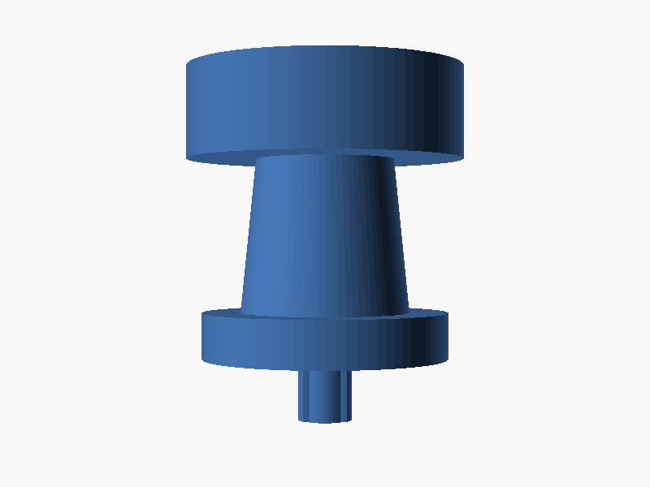
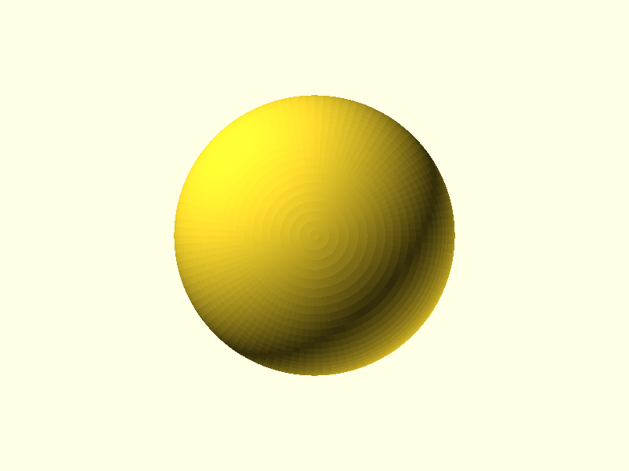

# Xbox 360 Controller Analog Stick Replacement

This repository contains 3D printable models for replacement analog sticks for the Xbox 360 controller.

The model faithfully reproduces the shape of the original Xbox 360 analog stick:
- **Concave thumb cap** – the recessed top surface keeps your thumb centred
- **Tapered shaft** – widens slightly toward the base for a natural feel
- **Base skirt** – the wider flange that rests on the controller faceplate
- **Bottom peg** – the small cylinder that inserts into the potentiometer housing

## Screenshots

| Front / Isometric View | Side View | Top View |
|---|---|---|
|  |  |  |

## Files

- `analog_stick.scad` - OpenSCAD source for the analog stick model
- `analog_stick.stl` - STL file for 3D printing (generate from scad using OpenSCAD)

## Dimensions

| Part | Dimension |
|---|---|
| Bottom peg diameter | 4.5 mm |
| Bottom peg height | 7.0 mm |
| Base / skirt diameter | 16.0 mm |
| Base / skirt height | 3.0 mm |
| Shaft diameter (bottom) | 11.0 mm |
| Shaft diameter (top) | 9.0 mm |
| Shaft height | 10.0 mm |
| Thumb cap diameter | 13.5 mm |
| Thumb cap height | 5.0 mm |
| Concave top depth | 1.5 mm |
| **Total height** | **25.0 mm** |

## Printing Instructions

- Material: PLA recommended
- Infill: 100% for durability
- Supports: None needed
- Resolution: 0.2 mm layer height

## Assembly

1. Disassemble your Xbox 360 controller (refer to iFixit guide or similar).
2. Remove the faulty analog stick from the sensor module.
3. Print the `analog_stick.stl` file.
4. Insert the bottom peg into the potentiometer housing (may require glue or light sanding for a snug press-fit).

Note: Adjust `peg_diameter` in the `.scad` file if the peg is too loose or too tight for your specific sensor module.

## Disclaimer

This is an open-source project for educational purposes. Use at your own risk. Ensure compatibility with your controller model.